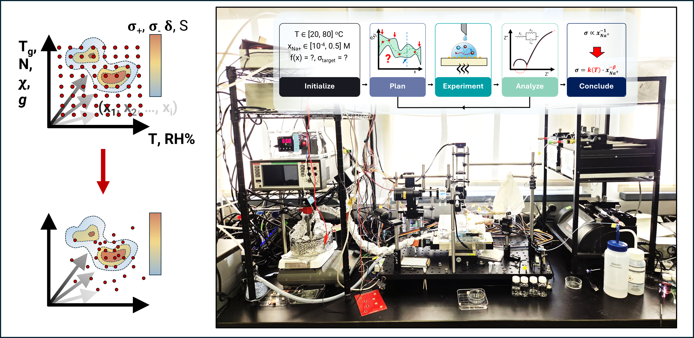

# SoftAE — Soft-matter Autonomous Experimentation
Authored by: 
Pavel Shapturenka,
Christopher W. Johnson,
Yvonne Zagzag,
Minki Lee,
 *In collaboration and with assistance from frontier agentic large-language models.*

**Osuji lab**, Department of Chemical and Biomolecular Engineering, University of Pennsylvania

Next-generation benchtop platform for autonomous (self-driving) soft materials science experiments, with automated/combinatorial modalities as a manual exploratory fallback.

Current SoftAE functionality integrates stage motion, liquid dispensing, environmental control (T/RH%), polarized optical microscopy, and conductivity measurements to afford high-throughput soft material formulation and inspection. High-throughput methods are in turn extended to autonomous experimentation via in-loop implementation of algorithms such as Bayesian optimization and Gaussian process-informed parameter phase space exploration.

Core system functionality is accessible through a central graphical interface and is operable with various degrees of autonomy.
The design intent is to be transparent in an instructive and functional manner. The codebase addresses many facets of a fully functional self-driving laboratory: orchestration, data analysis, algorithmic machinery, safety, reproducibility, telemetry, and data provenance.



## Quick Start

```bash
# Create a virtual environment
python -m venv .venv
.venv\Scripts\Activate.ps1      # Windows PowerShell

# Install in editable mode (no hardware dependencies)
pip install -e ".[dev]"

# Launch the GUI (runs with mock instruments by default)
softae-gui
```

## Project Structure

```
softae-next/
├── pyproject.toml              # Package metadata & dependencies
├── softae_config.toml          # Hardware addresses, paths, defaults
├── src/
│   └── softae/
│       ├── config/             # Configuration loader
│       ├── drivers/            # Instrument driver wrappers (Phase 0 refactored)
│       ├── server/             # InstrumentManager, BaseInstrument ABC
│       ├── workflows/          # Workflow engine (Phase 2)
│       ├── analysis/           # EIS analysis, fitting (Phase 2)
│       ├── optimizers/         # Bayesian, grid search (Phase 4)
│       └── gui/                # PySide6 multi-tab GUI (Phase 3)
│           ├── tabs/           # One module per tab
│           └── widgets/        # Reusable UI components
├── tests/                      # pytest test suite
├── workflows/                  # YAML workflow templates
└── docs/                       # Documentation
```

## Development Phases

- **Phase 0**: Code hygiene — eliminate globals, fix imports, add context managers
- **Phase 1**: Instrument server — BaseInstrument ABC, InstrumentManager, async drivers
- **Phase 2**: Workflow engine — YAML-defined experiments, structured logging
- **Phase 3**: Multi-tab GUI — PySide6 desktop application
- **Phase 4**: Autonomous loop — Bayesian optimization, closed-loop experiments
