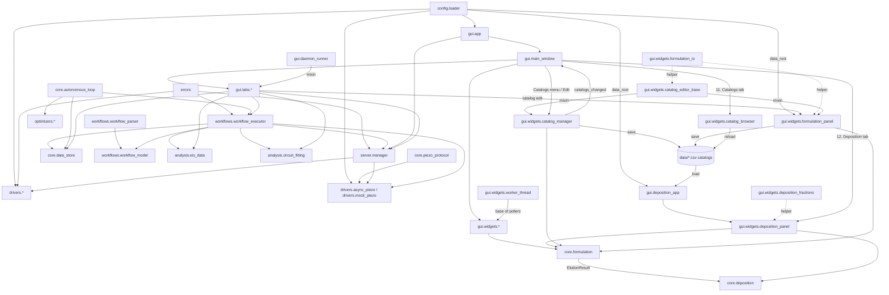
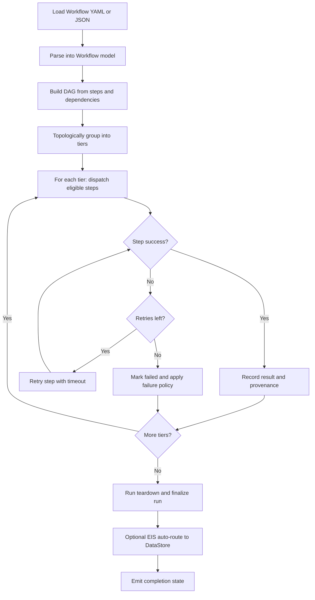

# Architecture

This page provides a compact structural view of `softae-next` module relationships and workflow execution control flow.

## Module Dependency Diagram

## Workflow Execution Flowchart (DAG-Tier Executor)

## Notes

- The workflow executor is async and tier-based for parallelizable steps.
- GUI tabs trigger execution through shared manager/executor plumbing and consume signal-based updates.
- Autonomous logic composes optimizer suggestions with workflow execution and DataStore feedback.
- Piezo integration uses `config.loader.piezo_config()` defaults merged from `[piezo]` and `[piezo.liquid_events]`.
- Manual tab sends direct piezo calls through the manager (`set_channel`, `apply_profile`, `standby`) via non-blocking command workers.
- HT Experiment injects optional piezo workflow steps around liquid handling when piezo liquid events are enabled; `settings_source` selects manual profile reuse vs explicit event profile apply.
- Worker-thread lifecycle: every polling worker QThread exposes an idempotent `stop_worker()`, each thread-owning tab an idempotent `cleanup()`, and `MainWindow.closeEvent` stops all workers (tab `cleanup()`s → own `_poller`/`_cam_worker`/`_webcam_worker` → defensive `findChildren(QThread)` sweep) so closing the window leaves no running QThread. The `stop_worker()` contract is now codified in a shared `StoppableWorker(QThread)` base (`gui/widgets/worker_thread.py`): a template `stop_worker(timeout_ms)` (isRunning guard → `_request_stop()` → `wait()`) that the 9 polling workers inherit, replacing their bespoke copies (per-worker timeouts preserved). The transient analysis fit workers (`_FitAllWorker`/`_ArrhFitWorker`) are parented to the Analysis tab so the `closeEvent` sweep reaches them too.
- Daemon-runner cooperative abort: the tabs that run long operations on `threading.Thread(daemon=True)` (`ExperimentBuilderTab`, Process Studio's embedded builder, `BOSimulatorTab`, `LiveBOCampaignTab`, `ArrheniusTab` — the standalone `SandboxTab` having been retired into Process Studio, and the single BO tab having split into an offline simulator and a live campaign) each add an idempotent `abort_run()` (signal-only, reusing the tab's Stop-button abort path) + `cleanup()` (abort-then-bounded-join with shared `DAEMON_JOIN_TIMEOUT` in `gui/_shutdown.py`). This contract is codified in a `DaemonRunnerMixin` (`gui/daemon_runner.py`, plain-object mixin) that implements `abort_run()`/`cleanup()` over per-tab hooks `_abort_run_impl()`/`_runner_thread()`. `MainWindow.closeEvent` signals `abort_run()` on all four **first** (so hardware sweeps stop issuing commands ASAP and wind down in parallel), then joins each via `cleanup()` — so closing mid-run cooperatively aborts the in-progress experiment/campaign/sweep instead of leaving it issuing commands.
