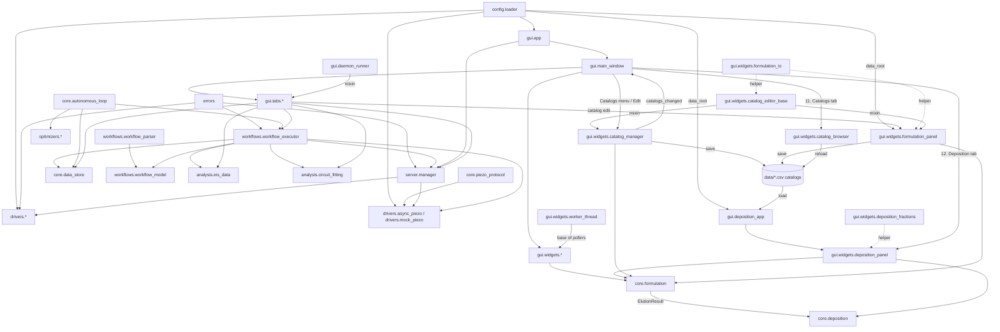
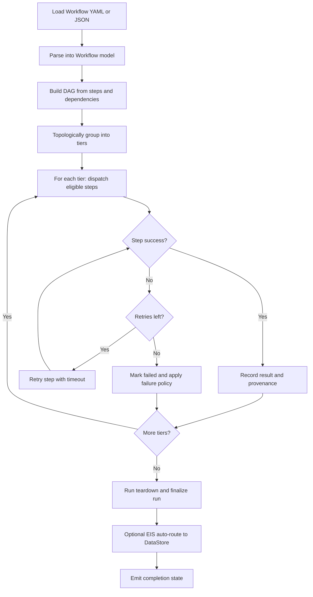
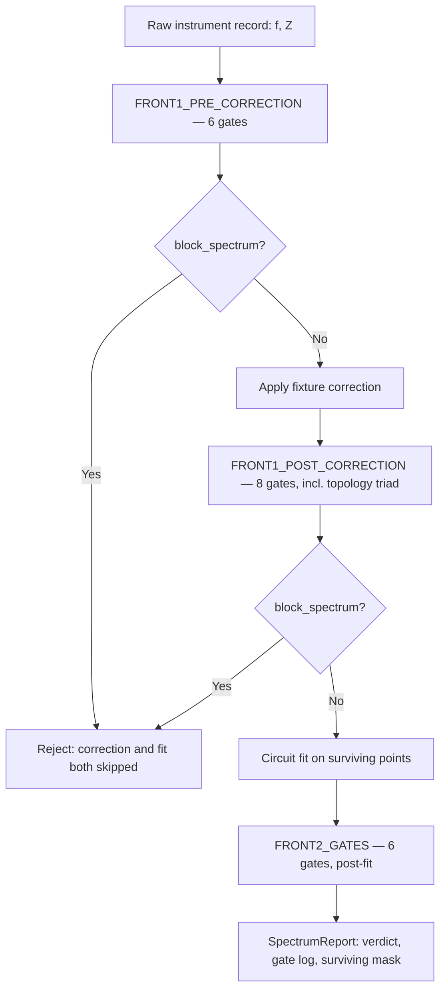

# Architecture

This page provides a compact structural view of `softae-next` module relationships and workflow execution control flow.

## Module Dependency Diagram

## Workflow Execution Flowchart (DAG-Tier Executor)

## EIS gate cascade — Front 1 / Front 2

`analysis.eis.gates` decides whether an impedance spectrum is admissible *before* a conductivity is extracted from it. The cascade runs in three stages, with fixture correction and the circuit fit interleaved between them, because each stage asks a question the previous stage's data could not answer.

| Stage | Constant | Gates | Runs on, and asks |
|---|---|---|---|
| 1 | `FRONT1_PRE_CORRECTION` | 6 | The raw instrument record — *did the instrument record something real?* Correcting first would let a subtraction rescue a spectrum the measurement itself failed. |
| 2 | `FRONT1_POST_CORRECTION` | 8, including the 3-member `TOPOLOGY_TRIAD` | Fixture-corrected data — *does this spectrum contain the physics being extracted?* Only answerable once the fixture's own contribution is gone. |
| 3 | `FRONT2_GATES` | 6 | The fitted model — *is the fit trustworthy?* |

A 21st gate, `gate_cross_spectrum_duplicates`, is defined and covered by tests but is called from no production path: it is series-level, needing two or more independent spectra, and `run_gates` sees one spectrum at a time.

### The organising result: Front 1 discriminates, Front 2 does not

Measured over 40 magnitude-matched spectra from `20260825T154521Z_arrhenius_sweep` — median `|Z|` held to 5×10⁵–2×10⁶ Ω, so scale cannot be what separates them; 21 operator-valid, 10 transitional, 9 dead — with each gate evaluated in isolation at its own cascade stage. `sep` is the true-positive rate minus the false-positive rate against the operator's labels.

| Gate | Stage | `sep` | Judges |
|---|---|---|---|
| `residual_norm` | Front 2 | **+0.81** | the fit's failure to describe the data |
| `tand_slope` | Front 1 post | +0.52 | data |
| `kk_truncation` | Front 1 post | +0.30 | data |
| `finiteness` | Front 1 pre | +0.22 | data |
| `magnitude` | Front 1 pre | +0.22 | data |
| `min_points` | Front 1 post | +0.11 | data |
| `series_rc` | Front 1 post | +0.11 | data |
| `valley_feature` | Front 1 post | +0.11 | data |
| `quadrant` | Front 1 pre | +0.04 | data |
| `residual_structure` | Front 2 | +0.03 | fit |
| `phase_noise_extrapolated` | Front 1 pre | 0.00 | fires on 40/40 — no discrimination |
| `monotonic_frequency` | Front 1 pre | 0.00 | silent on this corpus |
| `stuck_instrument` | Front 1 pre | 0.00 | silent on this corpus |
| `hf_inductive` | Front 1 post | 0.00 | silent on this corpus |
| `plateau_in_band` | Front 1 post | 0.00 | silent on this corpus |
| `pegged_parameters` | Front 2 | 0.00 | silent on this corpus |
| `relative_standard_error` | Front 2 | 0.00 | silent on this corpus |
| `cap_flatness` | Front 1 post | −0.11 | a dispersion exponent, not an admissibility verdict |
| `degeneracy` | Front 2 | −0.65 | fit |
| `model_free_crosscheck` | Front 2 | −0.97 | fit — a near-perfect inversion |

Every gate with positive separation judges the **data**; every gate at zero or below judges the **fit**. There are two named exceptions, one in each direction. `residual_norm` judges the fit's *failure to describe* the data and is therefore a data statement wearing a fit statement's clothes — which is why it is both the strongest gate here and the only blocking Front-2 gate. `cap_flatness` is a Front-1 gate that computes a dispersion exponent rather than an admissibility verdict, and so sits on the Front-2 side of the dichotomy despite its stage.

### Why this is structural, not a fact about one corpus

The 5-parameter covariance is rank-deficient on every spectrum that fits. Over all 54 spectra, 30 produce a covariance at all and **30 of 30 are rank-deficient** — 29 at rank 2 of 5, one at rank 3 — at condition numbers from 5.7×10²⁴ to 1.3×10²⁶. The other 24 produce no covariance at all, and the covariance gates then pass by fail-open. **So there are zero spectra on which those gates do what they were written to do.** Every post-fit statistic is taken along the optimiser's ridge rather than across the sample; `ρ(R_series, R_bulk) = ±1.000000` exactly is the R0/R1 block of that ridge.

**Rank here is threshold-dependent, and the threshold must be named wherever the number is quoted.** `np.linalg.matrix_rank`'s default tolerance is `rcond·max(σ)`. At a condition number near 10²⁵ the three missing singular directions are not merely poorly determined — they are beyond float64's ability to represent *as determined* relative to the largest. "Rank 2 of 5" is therefore a true and useful statement **about a chosen threshold**, and quoting it without the threshold overstates it.

### What ships

`[eis] engine = "legacy"` and `[eis.gates] enabled = false`, so the gated engine is not entered on the shipped path and no gate executes there. Inside the gated engine, `enabled` gates **spectrum-level rejection only**: `run_gates` applies `block_point` masks unconditionally, so points are dropped from the fit whether or not the flag is set.

> **This section describes the cascade as it currently stands and is expected to be revised.** A consolidation is approved in direction and is pending re-measurement; the resulting gate count is a hypothesis, not a plan. The long-form treatment — all 21 gates, their thresholds, and the framework sections each implements — is `docs/EIS_GATE_FRAMEWORK_new.md`, which is untracked and cannot survive a fresh checkout, so the summary above is the committed record.

## Notes

- The workflow executor is async and tier-based for parallelizable steps.
- GUI tabs trigger execution through shared manager/executor plumbing and consume signal-based updates.
- Autonomous logic composes optimizer suggestions with workflow execution and DataStore feedback.
- Piezo integration uses `config.loader.piezo_config()` defaults merged from `[piezo]` and `[piezo.liquid_events]`.
- Manual tab sends direct piezo calls through the manager (`set_channel`, `apply_profile`, `standby`) via non-blocking command workers.
- HT Experiment injects optional piezo workflow steps around liquid handling when piezo liquid events are enabled; `settings_source` selects manual profile reuse vs explicit event profile apply.
- Worker-thread lifecycle: every polling worker QThread exposes an idempotent `stop_worker()`, each thread-owning tab an idempotent `cleanup()`, and `MainWindow.closeEvent` stops all workers (tab `cleanup()`s → own `_poller`/`_cam_worker`/`_webcam_worker` → defensive `findChildren(QThread)` sweep) so closing the window leaves no running QThread. The `stop_worker()` contract is now codified in a shared `StoppableWorker(QThread)` base (`gui/widgets/worker_thread.py`): a template `stop_worker(timeout_ms)` (isRunning guard → `_request_stop()` → `wait()`) that the 9 polling workers inherit, replacing their bespoke copies (per-worker timeouts preserved). The transient analysis fit workers (`_FitAllWorker`/`_ArrhFitWorker`) are parented to the Analysis tab so the `closeEvent` sweep reaches them too.
- Daemon-runner cooperative abort: the tabs that run long operations on `threading.Thread(daemon=True)` (`ExperimentBuilderTab`, Process Studio's embedded builder, `BOSimulatorTab`, `LiveBOCampaignTab`, `ArrheniusTab` — the standalone `SandboxTab` having been retired into Process Studio, and the single BO tab having split into an offline simulator and a live campaign) each add an idempotent `abort_run()` (signal-only, reusing the tab's Stop-button abort path) + `cleanup()` (abort-then-bounded-join with shared `DAEMON_JOIN_TIMEOUT` in `gui/_shutdown.py`). This contract is codified in a `DaemonRunnerMixin` (`gui/daemon_runner.py`, plain-object mixin) that implements `abort_run()`/`cleanup()` over per-tab hooks `_abort_run_impl()`/`_runner_thread()`. `MainWindow.closeEvent` signals `abort_run()` on all four **first** (so hardware sweeps stop issuing commands ASAP and wind down in parallel), then joins each via `cleanup()` — so closing mid-run cooperatively aborts the in-progress experiment/campaign/sweep instead of leaving it issuing commands.
